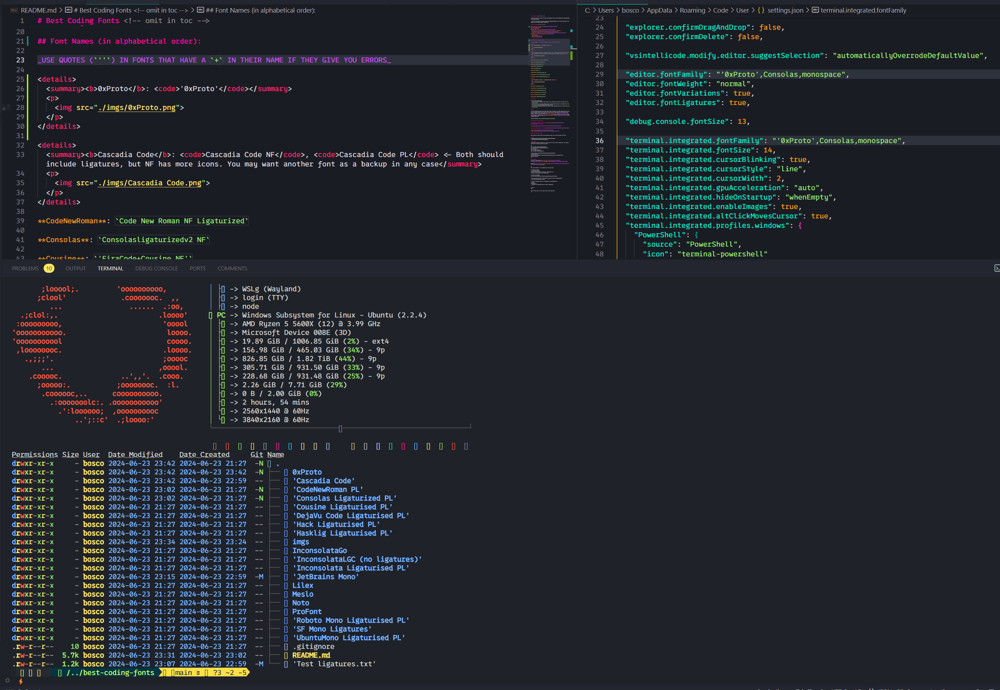
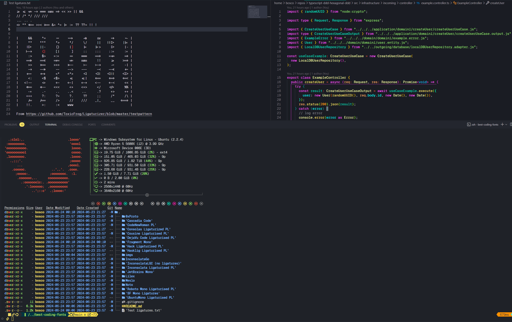

# Best Coding Fonts <!-- omit in toc -->

A repo with the fonts I recommend for Shells and Programming, most of them with Ligatures and Powerline/NerdFont glyphs (icons) support!

> Note: The fonts included in this repo are ones I've patched or are worth keeping as a backup. If I use the base Nerd Font, I will try to simply link to the original author's repo/website.

## Table of Contents <!-- omit in toc -->

1. [Font Names (in alphabetical order):](#font-names-in-alphabetical-order)
2. [Which font?](#which-font)
3. [VS Code](#vs-code)
4. [Great places to find more fonts](#great-places-to-find-more-fonts)
   1. [(Mostly) Only ligatures -\> can apply the Nerd Fonts' Patcher for glyphs/icons](#mostly-only-ligatures---can-apply-the-nerd-fonts-patcher-for-glyphsicons)
   2. [(Mostly) Glyphs/Icons -\> can apply Ligaturizer](#mostly-glyphsicons---can-apply-ligaturizer)
5. [Using the Nerd Fonts' Patcher](#using-the-nerd-fonts-patcher)
   1. [Windows/WSL](#windowswsl)
   2. [Linux/MacOS](#linuxmacos)
      1. [Gyphs/Icons (Nerd Font patcher)](#gyphsicons-nerd-font-patcher)
      2. [Ligaturizer](#ligaturizer)


## Font Names (in alphabetical order):

_USE QUOTES (`''`) IN FONTS THAT HAVE A `+` IN THEIR NAME IF THEY GIVE YOU ERRORS_

<details>
  <summary><b>0xProto</b>:  <code>'0xProto v1.6 Ligaturised NF'</code>,  <code>'0xProto v2 Ligaturised NF'</code>, <code>'0xProto v2 NF'</code>, <code>'0xProto v2 Nerd Font'</code></summary>
  <p>
    No ligatures (forgot to take screenshots after patching):<br>
    v1.6 Ligaturised:
    
    v2 Ligaturised:
    
    v2 Nerd Font:
    
    
  </p>
</details>

<details>
  <summary><b>Cascadia Code</b>: <code>Cascadia Code NF</code>, <code>Cascadia Code PL</code> <- Both should include ligatures, but NF has more icons. You may want another font as a backup in any case</summary>
  <p>
    
  </p>
</details>

**Code New Roman**: `Code New Roman NF Ligaturized`

<details>
  <summary><b>Consolas</b>: <code>Consolasligaturizedv2 NF</code>, <code>ConsolasLigaturizedV3 Nerd Font</code></summary>
  <p>
    There's barely any differences, so I only took one screenshot:
    
  </p>
</details>

**Cousine**: `'FiraCode+Cousine NF'`

**DejaVuSans**: `DejaVuSansCode NF`

<details>
  <summary><b>Fragment Mono</b>: <code>FragmentMono Nerd Font</code>, <code>Fragment Mono Regular</code></summary>
  <p>
    
    
  </p>
</details>

<details>
  <summary><b>Geist Mono</b>: <code>GeistMono Nerd Font</code></summary>
  <p>
    
  </p>
</details>

**Hack**: `'FiraCode+Hack NF'`

**Hasklig**: `Hasklug NF`

<details>
<summary><b>Inconsolata NF g</b>: <code>'FiraCode+Inconsolata NF g'</code></summary>
<p>
  
</p>
</details>

**Inconsolata**: `'FiraCode+Inconsolata NF'`

**InconsolataGo Nerd Font**: `InconsolataGo Nerd Font`

<details>
  <summary><b>JetBrains Mono</b>: <code>JetBrainsMono NF</code></summary>
  <p>
    
  </p>
</details>

<details>
  <summary><b>Julia Mono</b>: <code>JuliaMono</code></summary>
  <p>
    
  </p>
</details>

**Lilex Nerd Font**: `Lilex Nerd Font`

<details>
  <summary><b>Maple Mono</b>: <code>Maple Mono V7 NF</code>, <code>Maple Mono v6 Ligaturised NF</code>, <code>Maple Mono NF</code></summary>
  <p>
    I personally use v7, but v6 is quite great too.<br>
    v6:
    
    
    v7:
    
    
  </p>
</details>

**NotoMono Nerd Font**: `NotoMono Nerd Font`

**Roboto Mono**: `'FiraCode+RobotoMono NF'`

**SF Mono Ligaturised**: `SF Mono Ligatures`

**SF Mono Powerline**: `SF Mono Powerline`

**UbuntuMono**: `'FiraCode+UbuntuMono NF'`

## Which font?

From Nerd Fonts' documentation:
  * If you are limited to monospaced fonts (because of your terminal, etc) then pick a font with `Nerd Font Mono` (or `NFM`).
  * If you want to have bigger icons (usually around 1.5 normal letters wide) pick a font without `Mono` i.e. `Nerd Font` (or `NF`). Most terminals support this, but ymmv.
  * If you work in a proportional context (GUI elements or edit a presentation etc) pick a font with `Nerd Font Propo` (or `NFP`).

## VS Code

VS Code's integrated terminal will use icons from the fonts you provide in the order provided. That is, if the first font doesn't have the icon you want, it will fall back to the second font, and so on. That's why it's crucial to provide at least one fallback font. [Nerd Fonts provides such font](https://github.com/ryanoasis/nerd-fonts/releases/download/v3.2.1/NerdFontsSymbolsOnly.zip), but it's not included in the repo and I haven't found it useful. I personally always use [Consolas ligaturized v2 NF](Consolas%20Ligaturized%20PL/Source.md) as my fallback font. E.g.

`"editor.fontFamily": "Your font,Consolasligaturizedv2 NF,monospace"`

## Great places to find more fonts

### (Mostly) Only ligatures -> can apply the [Nerd Fonts' Patcher](https://github.com/betaboon/nerd-fonts-patcher) for glyphs/icons

- [Ligaturizer](https://github.com/ChristinWhite/ligaturizer/tree/master/output-fonts)

### (Mostly) Glyphs/Icons -> can apply [Ligaturizer](https://github.com/ChristinWhite/ligaturizer/tree/master)

- [Nerd Fonts Website](https://www.nerdfonts.com/font-downloads)
- [Nerd Fonts](https://github.com/ryanoasis/nerd-fonts/tree/master/patched-fonts)

## Using the Nerd Fonts' Patcher

This is more for me than for you, but I've included the steps I use to patch the fonts in this repo.

### Windows/WSL

I have tried on Windows but FontForge is a pain to use, so in case you want to recreate what I did I suggest using Linux or at least WSL, which is far easier.

### Linux/MacOS

#### Gyphs/Icons ([Nerd Font patcher](https://github.com/ryanoasis/nerd-fonts#font-patcher))

Optionally you can get it [from Nerd Font's website](https://github.com/ryanoasis/nerd-fonts/releases/latest/download/FontPatcher.zip) or [from the repo](https://github.com/ryanoasis/nerd-fonts#font-patcher).

```sh
# Pre-requisites
sudo add-apt-repository ppa:fontforge/fontforge -y
sudo apt update -y
sudo apt install software-properties-common python3-fontforge -y
brew install python-setuptools fontforge # or the alternative for your Linux distro

# Download and extract manually, then
cd Downloads/FontPatcher/
# Or
wget https://github.com/ryanoasis/nerd-fonts/releases/latest/download/FontPatcher.zip
unzip FontPatcher.zip -d font-patcher
cd font-patcher
# Or
git clone --depth 1 https://github.com/betaboon/nerd-fonts-patcher.git
cd nerd-fonts-patcher

# Then run:
fontforge -script ./font-patcher -l -c --careful -out /path/to/output_dir --ext otf /path/to/font
# And the new files should be in the output folder chosen

# Example (in WSL)
fontforge -script ./font-patcher -l -c --careful -out ./patched-fonts --ext otf /mnt/d/Users/Bosco/Downloads/Fonts/0xProto/0xProto-Regular.otf

# You can drop the --careful if you want to override the existing icons
```

You can use the [./patch-fonts.sh](./patch-fonts.sh) script to patch all the fonts contained in a folder. Play around with it if you desire.

The other option is using Docker, as per the font-patcher's README. This may probably be easier and faster, but I haven't tried it.

#### [Ligaturizer](https://github.com/ToxicFrog/Ligaturizer)

```sh
# To obtain the ligatures
git clone --recurse-submodules https://github.com/ToxicFrog/Ligaturizer.git

# Do not remove any of the fonts in `fonts/`, they're needed for the ligaturizer to work

# Make sure to move the fonts you want changed into their own folder in Ligaturizer/fonts
# e.g. Ligaturizer/fonts/Code New Roman/

# Add them to build.py, whether on the prefixed_fonts or renamed_fonts. e.g
# build.py
renamed_fonts = {
  'fonts/Code New Roman/*.otf': 'Code New Roman NF Ligaturized',
}

# Then run
make

# And the files should be in the output folder with the correct name
```